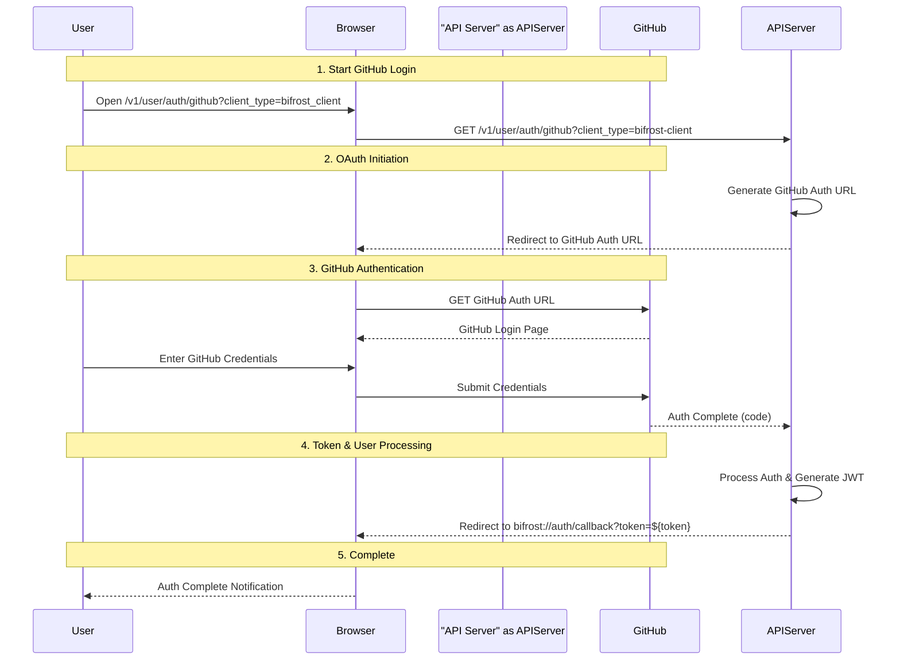

## Authentication Flow

```mermaid
sequenceDiagram
    participant User
    participant Browser
    participant "API Server" as APIServer
    participant GitHub

    Note over User, GitHub: 1. Start GitHub Login
    User->>Browser: Open /v1/user/auth/github?client_type=bifrost_client
    Browser->>APIServer: GET /v1/user/auth/github?client_type=bifrost-client

    Note over User, GitHub: 2. OAuth Initiation
    APIServer->>APIServer: Generate GitHub Auth URL
    APIServer-->>Browser: Redirect to GitHub Auth URL

    Note over User, GitHub: 3. GitHub Authentication
    Browser->>GitHub: GET GitHub Auth URL
    GitHub-->>Browser: GitHub Login Page
    User->>Browser: Enter GitHub Credentials
    Browser->>GitHub: Submit Credentials
    GitHub-->>APIServer: Auth Complete (code)

    Note over User, GitHub: 4. Token & User Processing
    APIServer->>APIServer: Process Auth & Generate JWT
    APIServer-->>Browser: Redirect to bifrost://auth/callback?token=${token}

    Note over User, GitHub: 5. Complete
    Browser-->>User: Auth Complete Notification
```