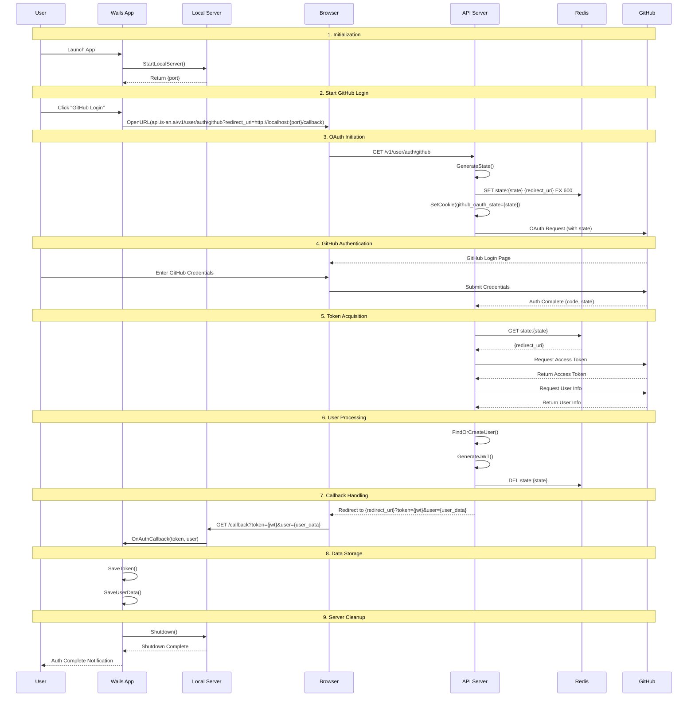
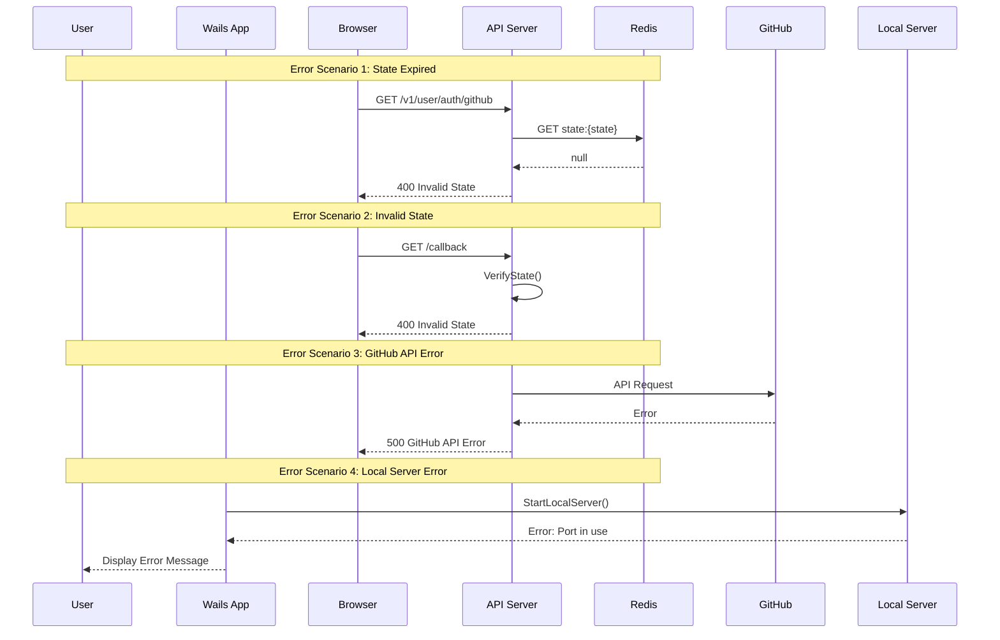

## Authentication Flow

```mermaid
sequenceDiagram
    participant User
    participant Wails App
    participant Local Server
    participant Browser
    participant API Server
    participant Redis
    participant GitHub

    Note over User, GitHub: 1. Initialization
    User->>Wails App: Launch App
    Wails App->>Local Server: StartLocalServer()
    Local Server-->>Wails App: Return {port}

    Note over User, GitHub: 2. Start GitHub Login
    User->>Wails App: Click "GitHub Login"
    Wails App->>Browser: OpenURL(api.is-an.ai/v1/user/auth/github?redirect_uri=http://localhost:{port}/callback)
    
    Note over User, GitHub: 3. OAuth Initiation
    Browser->>API Server: GET /v1/user/auth/github
    API Server->>API Server: GenerateState()
    API Server->>Redis: SET state:{state} {redirect_uri} EX 600
    API Server->>API Server: SetCookie(github_oauth_state={state})
    API Server->>GitHub: OAuth Request (with state)
    
    Note over User, GitHub: 4. GitHub Authentication
    GitHub-->>Browser: GitHub Login Page
    User->>Browser: Enter GitHub Credentials
    Browser->>GitHub: Submit Credentials
    GitHub-->>API Server: Auth Complete (code, state)
    
    Note over User, GitHub: 5. Token Acquisition
    API Server->>Redis: GET state:{state}
    Redis-->>API Server: {redirect_uri}
    API Server->>GitHub: Request Access Token
    GitHub-->>API Server: Return Access Token
    API Server->>GitHub: Request User Info
    GitHub-->>API Server: Return User Info
    
    Note over User, GitHub: 6. User Processing
    API Server->>API Server: FindOrCreateUser()
    API Server->>API Server: GenerateJWT()
    API Server->>Redis: DEL state:{state}
    
    Note over User, GitHub: 7. Callback Handling
    API Server-->>Browser: Redirect to {redirect_uri}?token={jwt}&user={user_data}
    Browser->>Local Server: GET /callback?token={jwt}&user={user_data}
    Local Server->>Wails App: OnAuthCallback(token, user)
    
    Note over User, GitHub: 8. Data Storage
    Wails App->>Wails App: SaveToken()
    Wails App->>Wails App: SaveUserData()
    
    Note over User, GitHub: 9. Server Cleanup
    Wails App->>Local Server: Shutdown()
    Local Server-->>Wails App: Shutdown Complete
    Wails App-->>User: Auth Complete Notification
```

## Error flow

```mermaid
sequenceDiagram
    participant User
    participant Wails App
    participant Browser
    participant API Server
    participant Redis

    Note over User, Redis: Error Scenario 1: State Expired
    Browser->>API Server: GET /v1/user/auth/github
    API Server->>Redis: GET state:{state}
    Redis-->>API Server: null
    API Server-->>Browser: 400 Invalid State

    Note over User, Redis: Error Scenario 2: Invalid State
    Browser->>API Server: GET /callback
    API Server->>API Server: VerifyState()
    API Server-->>Browser: 400 Invalid State

    Note over User, Redis: Error Scenario 3: GitHub API Error
    API Server->>GitHub: API Request
    GitHub-->>API Server: Error
    API Server-->>Browser: 500 GitHub API Error

    Note over User, Redis: Error Scenario 4: Local Server Error
    Wails App->>Local Server: StartLocalServer()
    Local Server-->>Wails App: Error: Port in use
    Wails App-->>User: Display Error Message
```