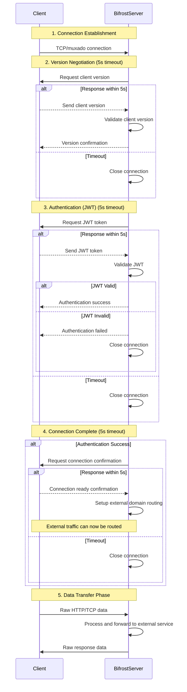

## Handshake Protocol Flow



## Protocol Details

### Step 1: Connection Establishment
- Client establishes TCP or muxado connection to Bifrost Server
- Basic network connectivity verification

### Step 2: Version Negotiation (5s timeout)
- **Server → Client**: Request client version information
- **Client → Server**: Send client version within 5 seconds
- **Server**: Validate client version
- **Server → Client**: Confirm version compatibility
- If client doesn't respond within 5s or version mismatch: Connection terminated

### Step 3: Authentication (JWT) (5s timeout)
- **Server → Client**: Request JWT token for authentication
- **Client → Server**: Send JWT token within 5 seconds
- **Server**: Validate JWT token
- **Server → Client**: Authentication result
  - Success: Proceed to next step
  - Failure or Timeout: Close connection

### Step 4: Connection Complete (5s timeout)
- **Server → Client**: Request connection confirmation
- **Client → Server**: Send connection ready confirmation within 5 seconds
- **Server**: Setup external domain routing for authenticated client
- If client doesn't respond within 5s: Connection terminated
- External traffic can now be routed through the established connection

### Step 5: Data Transfer Phase
- **Client → Server**: Raw HTTP/TCP data (original format)
- **Server**: Process data, apply necessary header modifications
- **Server**: Forwards to external service
- **Server**: Returns response as raw bytes to client

## Message Types

### Base Message Structure
All handshake messages follow this base structure:
```protobuf
message HandshakeMessage {
  MessageType type = 1;
  int64 timestamp = 2;
  bytes payload = 3;
}

enum MessageType {
  UNKNOWN = 0;
  
  // Step 2: Version Negotiation
  VERSION_REQUEST = 1;
  VERSION_RESPONSE = 2;
  VERSION_CONFIRM = 3;
  
  // Step 3: Authentication
  AUTH_REQUEST = 4;
  AUTH_RESPONSE = 5;
  AUTH_SUCCESS = 6;
  AUTH_FAILURE = 7;
  
  // Step 4: Connection Complete
  CONNECTION_REQUEST = 8;
  CONNECTION_CONFIRM = 9;
  
  // Error messages
  ERROR = 10;
  TIMEOUT = 11;
}
```

### Step 2: Version Negotiation Messages

#### VersionRequest (Server → Client)
```protobuf
message VersionRequest {
  string server_version = 1;
  string min_version = 2;
}
```

#### VersionResponse (Client → Server)
```protobuf
message VersionResponse {
  string client_version = 1;
  string build_number = 2;
  string platform = 3;
}
```

#### VersionConfirm (Server → Client)
```protobuf
message VersionConfirm {
  bool compatible = 1;
  string message = 2;
}
```

### Step 3: Authentication Messages

#### AuthRequest (Server → Client)
```protobuf
message AuthRequest {
  bool required = 1;
}
```

#### AuthResponse (Client → Server)
```protobuf
message AuthResponse {
  string jwt_token = 1;
}
```

#### AuthSuccess (Server → Client)
```protobuf
message AuthSuccess {
  string user_id = 1;
  string username = 2;
  string user_type = 3; // "free" or "premium"
}
```

#### AuthFailure (Server → Client)
```protobuf
message AuthFailure {
  string reason = 1;
  string code = 2;
}
```

### Step 4: Connection Complete Messages

#### ConnectionRequest (Server → Client)
```protobuf
message ConnectionRequest {
  string domain = 1;
}
```

#### ConnectionConfirm (Client → Server)
```protobuf
message ConnectionConfirm {
  bool ready = 1;
  string error = 2;
}
```

### Error Messages

#### ErrorMessage
```protobuf
message ErrorMessage {
  string code = 1;
  string message = 2;
  string details = 3;
}
```

#### TimeoutMessage
```protobuf
message TimeoutMessage {
  string step = 1;
  int32 timeout_seconds = 2;
}
```

## Data Transfer Protocol

### Raw Data Message
After handshake completion, all data is transferred as raw bytes:
```protobuf
message DataMessage {
  bytes data = 1;  // Original HTTP/TCP data
}
```

### Data Flow
1. **Client**: Sends original HTTP/TCP data as raw bytes
2. **Server**: Receives data, applies necessary modifications (headers, etc.)
3. **Server**: Forwards to external service
4. **Server**: Returns response as raw bytes to client

### Header Modifications (Server-side)
- **User-Agent**: Modified to identify Bifrost client
- **X-Forwarded-For**: Added to preserve client IP
- **Authorization**: Modified based on authentication
- **Other headers**: As needed for routing and security

## Encoding
- **Handshake Phase**: Protocol Buffers (protobuf) with double encoding
- **Data Phase**: Raw bytes (original HTTP/TCP format)
- **Message Size**: Variable length, prefixed with length header
- **Endianness**: Little-endian for length prefixes

## Error Handling
- **Version incompatibility**: Connection terminated
- **Invalid JWT**: Connection terminated
- **Network issues**: Retry mechanism
- **Client timeout (5s per step)**: Connection terminated immediately
- **Setup failure**: Connection terminated

## Timeout Rules
- **All client responses**: Must be sent within 5 seconds of server request
- **Connection termination**: Immediate upon client timeout
- **No retry on timeout**: Client must establish new connection
- **Timeout applies to**: Client version response, JWT response, connection confirmation
