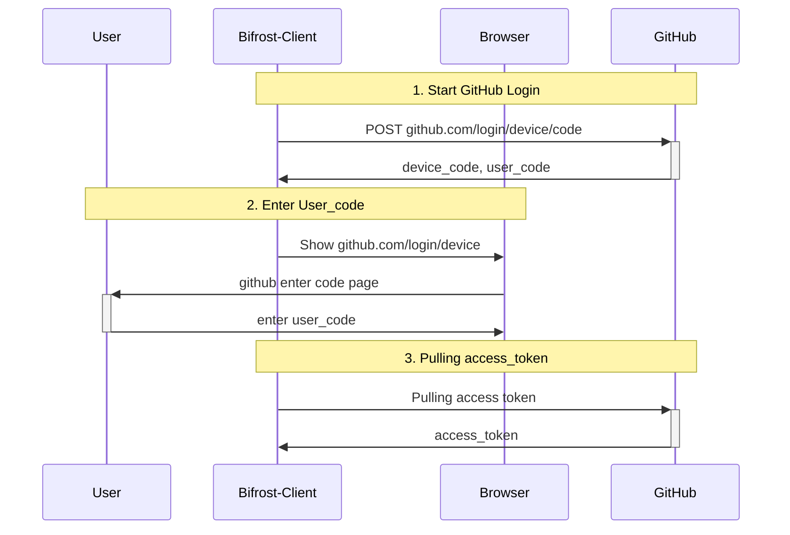

## Authentication Flow

```mermaid
sequenceDiagram
    participant User
    participant Client as Bifrost-Client
    participant Browser
    participant GitHub

    Note over Client, GitHub: 1. Start GitHub Login
    Client->>+GitHub: POST github.com/login/device/code
    GitHub->>-Client: device_code, user_code
    
    Note over User, Browser: 2. Enter User_code
    Client->>Browser: Show github.com/login/device
    Browser->>+User: github enter code page
    User->>-Browser: enter user_code

    Note over Client, GitHub: 3. Pulling access_token
    Client->>+ GitHub: Pulling access token
    GitHub->>- Client: access_token  
```